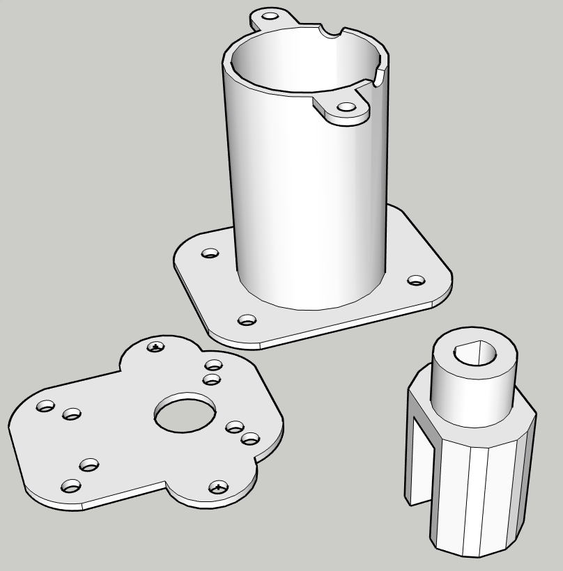

# smartlock

The aim of this project is to create a smart lock that can be easily configured. 

## Hardware
Components that will be used:
  - ESP-32s
  - DC Worm Motor with Encoder (Rated Torque: >6.5kg.cm)
  - L9110s Motor Driver
  - RC522 (Reading NFC tags)
  - 3D printed base for the motor to connect with the key (Check image at the bottom)

## Software
It is using WiFi to connect to an MQTT Server and has support for Over the Air updates.

These are the messages that are supported:
  - **smartlock/rfid_uid** message=[<uid>]
  - **smartlock/status** message=['online']
  - **smartlock/rfidadd_timer** message=['ON','OFF']
  - **smartlock/rfiddel_timer** message=['ON','OFF']
  - **smartlock/access** message=['authorized','denied']
  - **smartlock/saved_uids** message=[<uid list>]

  - **smartlock/rfidadd_timer/set** message=['ON','OFF']
  - **smartlock/rfiddel_timer/set** message=['ON','OFF']
  - **smartlock/saved_uids/set** message=['DELETE','']

